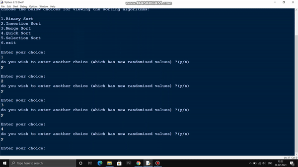
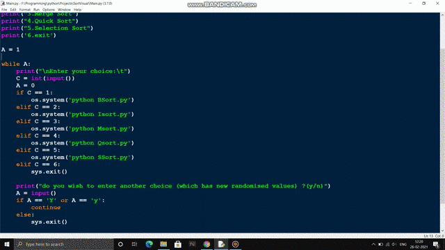
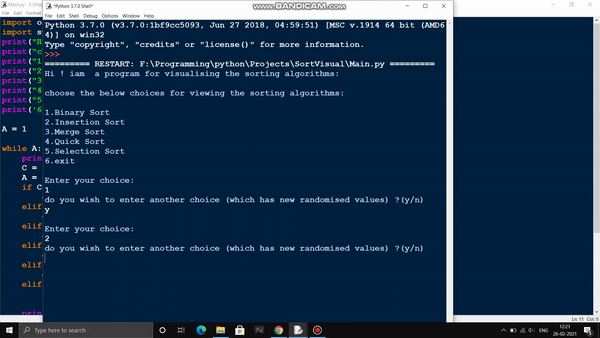
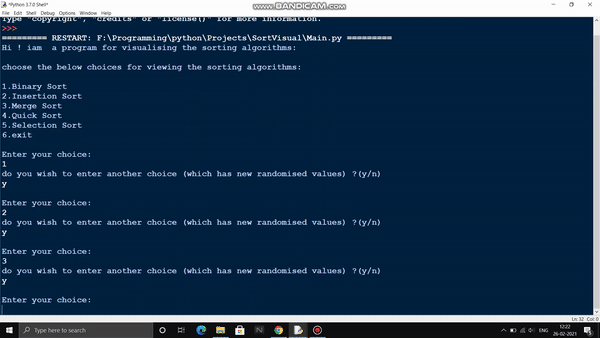
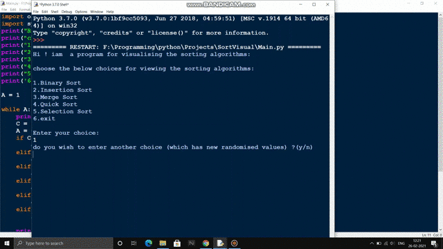

# VisualSort
## this repo contains code for visualising the 5 general sorting algorithms

**Requirements** : python 3.6 or higher
Packages required : numpy , pygame

step to carry out:
    1. you can execute the code either each algorithms independently for visualising 
     
     [OR]
 
    2.you can visualise using a common menu for choosing the algorithms "main.py"

    3.open the py file main.py using python interpretor

    4.display UI in cmd shell would pop up and you can check out the cool visualisation

Here are the Results:
**1.SELECTION SORT:**

  

**2.BUBBLE SORT:**

  

**3.MERGE SORT:**

  

**4.QUICK SORT:**

  

**5.INSERTION SORT:**

  

